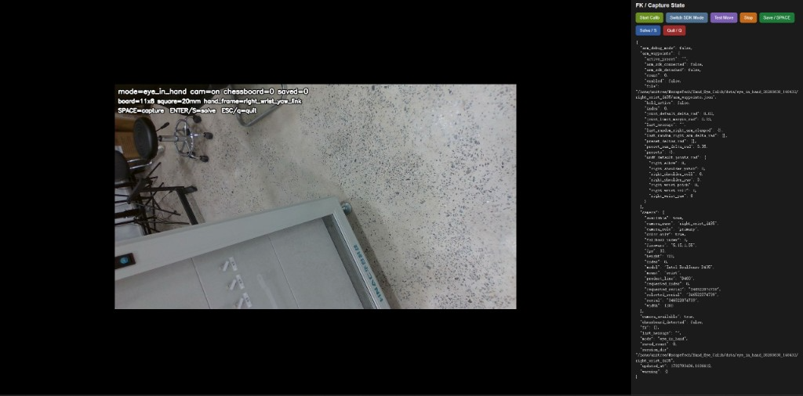
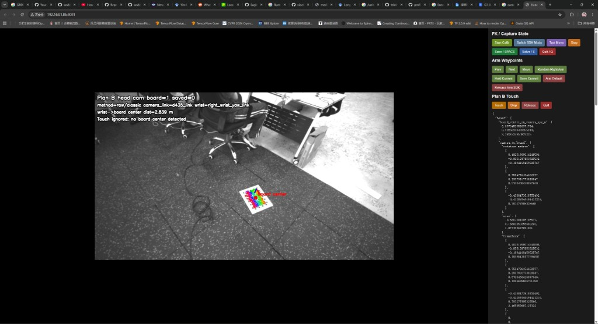
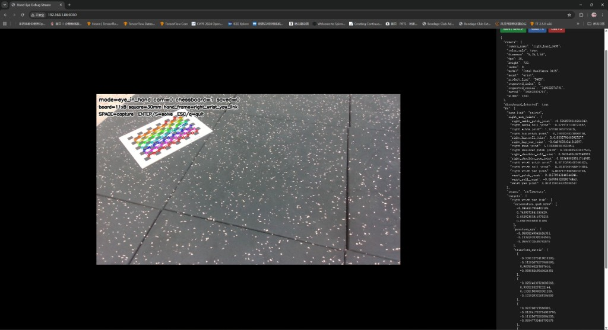

# Unitree 手眼标定工具

面向 Unitree 人形机器人（G1、H2 及兼容 URDF + SDK2 的型号）的 RealSense D435/D435i 手眼标定工具包。

## 功能

- **Eye-in-hand / Eye-to-hand** 棋盘格采集与 OpenCV 求解
- **网页端**：无头机器人主机上通过浏览器预览 MJPEG、查看 JSON 状态、远程按键
- 采集时从 `rt/lowstate` 读取关节并做 **URDF 正运动学**
- 可选 **右臂 waypoint**（`rt/arm_sdk`）辅助采集多样姿态
- 离线对已保存 session 重新求解
- **H2 适配层**：虚拟末端 `R_ee`、腰关节锁定 FK

## 网页界面预览

启动 `capture_handeye.py` 并加上 `--stream-debug --stream-fk --headless` 后，在浏览器打开 `http://<机器人主机IP>:<端口>/` 即可操作。下图来自实机调试界面（示例截图，不含可复用的现场配置）。

### 1. Eye-in-hand 采集待命



左侧为 RealSense 实时画面，叠加 `mode`、`chessboard`、`saved`、棋盘尺寸与 `hand_frame` 等状态；右侧提供 **Save / Solve / Quit** 及 SDK 模式切换按钮，下方 JSON 同步刷新相机信息与 FK 状态。此时尚未检测到棋盘格（`chessboard=0`）。

### 2. 棋盘格检测成功 + 扩展控制



棋盘格角点与坐标轴叠加在画面上，可读取 `wrist→board` 距离等调试信息。右侧除基础采集按钮外，还可启用 **Arm Waypoints**（保存/切换/运动 waypoint）与 **Plan B Touch**（触达验证）等扩展流程；JSON 中会输出 `board_extrinsic`、`transform` 等中间结果。

### 3. 角点标注与实时 FK



检测成功时角点以彩色圆点标出（`chessboard=1`）。画面左上角提示快捷键：`SPACE` 采集、`S` 求解、`Q` 退出。右侧 JSON 实时显示 `right_arm_joints` 与 `transform_matrix`，用于确认每次按 **Save** 时保存的机器人位姿与图像一致。

## 目录结构

```text
unitree-handeye-calib/
├── capture_handeye.py       # 主入口：采集 + 网页 + 求解
├── solve_offline.py         # 离线重算
├── calibrate_camera.py      # 相机内参标定
├── auto_capture_handeye.py  # 自动采样本（可选）
├── handeye_calib/           # 相机、棋盘格、求解器、网页服务
├── robot_kinematics/        # URDF FK + Unitree lowstate 桥接
├── h2/                      # H2 封装与 FK 诊断
├── data/                    # 预设（采集数据默认不入库）
├── outputs/                 # 求解结果（不入库）
└── robots/                  # 自行放置 URDF（仓库不附带）
```

## 依赖安装

```bash
python3 -m venv .venv
source .venv/bin/activate          # Windows: .venv\Scripts\activate
pip install -r requirements.txt
```

实机采集额外需要：

| 组件 | 说明 |
|------|------|
| RealSense D435/i | 彩色流 + 出厂内参 |
| 打印棋盘格 | 标定靶标 |
| 机器人 URDF | Eye-in-hand 需要 FK |
| `unitree_sdk2_python` + `cyclonedds` | 订阅 `rt/lowstate`，可选 `rt/arm_sdk` |
| 正确的 DDS 网卡名 | 以 `ip link` 为准，因机器而异 |

列出相机：

```bash
python -c "from handeye_calib.camera import RealSenseD435i; print(RealSenseD435i.list_devices())"
```

**务必使用 `--cam-serial`**，不要只依赖 USB 序号（热插拔后可能变化）。

URDF 放到 `robots/`（见 `robots/README.md`），或用 `--fk-urdf` 指定绝对路径。

## 坐标约定

每组样本包含：

1. 棋盘格在 **相机系** 的位姿（PnP）
2. **末端/hand** 在 **基座系** 的位姿 `T_base_hand`

手动输入位姿默认格式：

```text
x y z rx ry rz
平移：mm
旋转：deg，欧拉角 XYZ
```

Eye-in-hand 求解输出：

```text
outputs/eye_in_hand_<时间戳>_npy/T_cam2hand.npy
outputs/eye_in_hand_<时间戳>_npy/T_hand2cam.npy
```

## 快速开始：网页采集（Eye-In-Hand）

在机器人主机上（SSH 无图形界面即可）：

```bash
python capture_handeye.py \
  --mode eye-in-hand \
  --stream-debug \
  --stream-fk \
  --headless \
  --color-only \
  --cam-serial <你的相机序列号> \
  --fk-urdf robots/g1/g1_29dof_mode_15_with_dex1_1.urdf \
  --fk-base-link pelvis \
  --hand-frame right_wrist_yaw_link \
  --fk-network-interface <你的DDS网卡> \
  --cols 11 --rows 8 --square-mm 20 \
  --stream-host 0.0.0.0 --stream-port 8080
```

局域网浏览器访问：

```text
http://<机器人主机IP>:8080/
```

| 地址 | 说明 |
|------|------|
| `/` | 控制面板 + 实时画面 |
| `/state` | JSON：检测、FK、样本数等 |
| `/stream.mjpg` | 标注 MJPEG 流 |

常用网页操作：**Save** 保存样本、**Solve** 求解、**Quit** 退出。  
启用 `--enable-arm-waypoints` 后可用右臂关节滑条，详见 [docs/web_calibration.md](docs/web_calibration.md)。

## H2（虚拟 R_ee + 锁腰）

```bash
cd h2
python3 capture_h2_handeye.py \
  --cam-serial <你的相机序列号> \
  --fk-urdf <H2.urdf路径> \
  --fk-network-interface <你的DDS网卡>
```

说明见 [h2/README.md](h2/README.md)。

FK 对比诊断（只读，不下发运动指令）：

```bash
python3 h2/compare_h2_fk.py --iface <你的DDS网卡> --lock-waist
```

## 离线求解

```bash
python solve_offline.py \
  --mode eye-in-hand \
  --data-dir data/eye_in_hand_<时间戳>/<相机名>
```

切换 OpenCV 方法：

```bash
python solve_offline.py --mode eye-in-hand --data-dir <session目录> --handeye-method park
```

## 质量检查

采集时关注网页 JSON 中的 `pnp_rms`。求解后查看：

- `quality.translation_std_m_xyz`
- `quality.rotation_error_deg_each`

建议采集 **12～20** 组，包含明显的平移与旋转变化。

## 公开发布注意事项

- 不要提交现场标定结果、`outputs/`、原始采图、waypoint JSON
- 相机序列号、机器人 IP、网卡名请写在你自己的私有脚本里
- 网页默认监听 `0.0.0.0`，公网环境请加防火墙

## 上游许可

Unitree URDF 与 `unitree_sdk2_python` 遵循各自上游许可；本工具层按原样提供，便于接入你自己的部署环境。
