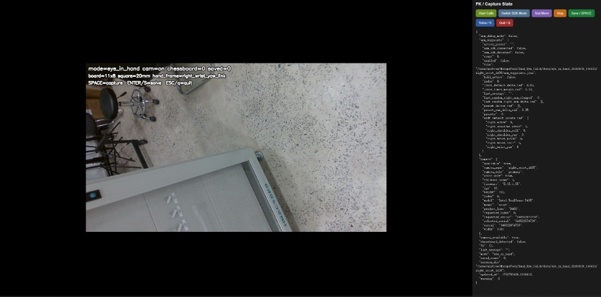
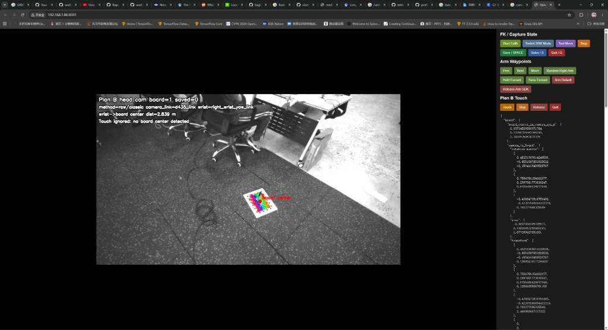
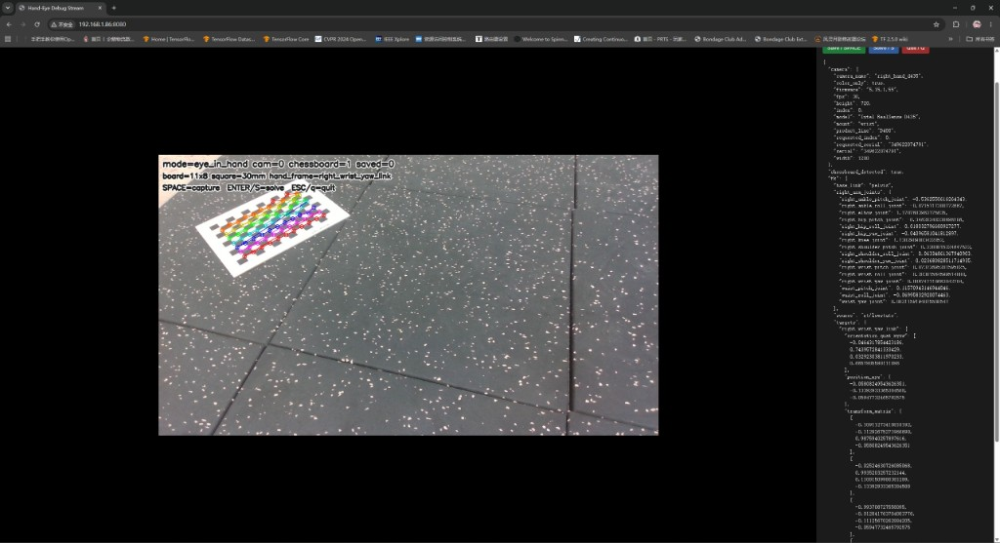

# Unitree 手眼标定工具

面向 Unitree 人形机器人（G1、H2 及兼容 URDF + SDK2 的型号）的 RealSense D435/D435i 手眼标定工具包。

## 功能

- **Eye-in-hand / Eye-to-hand** 棋盘格采集与 OpenCV 求解
- **网页端**：无头机器人主机上通过浏览器预览 MJPEG、查看 JSON 状态、远程按键
- 采集时从 `rt/lowstate` 读取关节并做 **URDF 正运动学**
- 可选 **右臂 waypoint**（`rt/arm_sdk`）辅助采集多样姿态
- 离线对已保存 session 重新求解
- **严格标定流水线**：内参覆盖率、采集同步、静止状态、闭环与子集稳定性门禁
- 使用独立新姿态对 Eye-in-hand 外参做闭环及绝对位置验证
- **H2 适配层**：虚拟末端 `R_ee`、腰关节锁定 FK
- **多相机切换**：网页 **Next Camera** 在已连接的 RealSense 之间轮换
- **H2 上臂扫掠**：随机可达关节位姿，确认后再走下一点
- **末端点动**：躯干系 XYZ 平移、相机系 RPY 旋转，经 URDF 逆解下发
- **重力前馈**：按 URDF 连杆质量计算 `rt/arm_sdk` 力矩，可叠加腕部负载估计

## 网页界面预览

启动 `capture_handeye.py` 并加上 `--stream-debug --stream-fk --headless` 后，在浏览器打开 `http://<机器人主机IP>:<端口>/` 即可操作。下图来自实机调试界面（示例截图，不含可复用的现场配置）。

### 1. Eye-in-hand 采集待命



左侧为 RealSense 实时画面，叠加 `mode`、`chessboard`、`saved`、棋盘尺寸与 `hand_frame` 等状态；右侧提供 **Save / Solve / Quit** 及 SDK 模式切换按钮，下方 JSON 同步刷新相机信息与 FK 状态。此时尚未检测到棋盘格（`chessboard=0`）。

### 2. 棋盘格检测成功 + 扩展控制



棋盘格角点与坐标轴叠加在画面上，可读取 `wrist→board` 距离等调试信息。右侧除基础采集按钮外，还可启用 **Arm Waypoints**（保存/切换/运动 waypoint）与 **Plan B Touch**（触达验证）等扩展流程；JSON 中会输出 `board_extrinsic`、`transform` 等中间结果。

### 3. 角点标注与实时 FK



检测成功时角点以彩色圆点标出（`chessboard=1`）。画面左上角提示快捷键：`SPACE` 采集、`S` 求解、`Q` 退出。右侧 JSON 实时显示 `right_arm_joints` 与 `transform_matrix`，用于确认每次按 **Save** 时保存的机器人位姿与图像一致。

### 4. 上臂扫掠面板

终端 B 的 `random_upper_arm_sweep.py` 连上后，页面会出现扫掠状态和点动按钮。状态为可输入时才接受 **下一个 / 再抽 / 点动**。这些按钮发给终端 B，由终端 B 做逆解并发布 `rt/arm_sdk`。终端 A 的 Arm Waypoints 不要同时接管同一条话题。现有截图不包含这块面板。

## 目录结构

```text
unitree-handeye-calib/
├── capture_handeye.py       # 主入口：采集 + 网页 + 求解
├── solve_offline.py         # 离线重算
├── calibrate_camera.py      # 相机内参标定
├── auto_capture_handeye.py  # 自动采样本（可选）
├── random_upper_arm_sweep.py           # H2 上臂扫掠 / 末端点动（默认只写文件）
├── strict_calibration_pipeline.py      # 严格内参/手眼求解与双批次对比
├── validate_eye_in_hand_absolute.py    # 独立姿态绝对位置验证
├── handeye_calib/           # 相机、棋盘格、求解器、网页、H2 IK 与重力
├── robot_kinematics/        # URDF FK + Unitree lowstate 桥接
├── h2/                      # H2 虚拟末端封装与 FK 诊断
├── tests/                   # 严格流水线、扫掠、求解器和采集安全测试
├── data/                    # 预设（采集数据默认不入库）
├── outputs/                 # 求解结果（不入库）
└── robots/                  # 自行放置 URDF（仓库不附带）
```

## 依赖安装

```bash
python3 -m venv .venv
source .venv/bin/activate          # Windows: .venv\Scripts\activate
pip install -r requirements.txt
```

实机采集额外需要：

| 组件 | 说明 |
|------|------|
| RealSense D435/i | 彩色流 + 出厂内参 |
| 打印棋盘格 | 标定靶标 |
| 机器人 URDF | Eye-in-hand 需要 FK |
| `unitree_sdk2_python` + `cyclonedds` | 订阅 `rt/lowstate`，可选 `rt/arm_sdk` |
| 正确的 DDS 网卡名 | 以 `ip link` 为准，因机器而异 |

列出相机：

```bash
python -c "from handeye_calib.camera import RealSenseD435i; print(RealSenseD435i.list_devices())"
```

**务必使用 `--cam-serial`**，不要只依赖 USB 序号（热插拔后可能变化）。

URDF 放到 `robots/`（见 `robots/README.md`），或用 `--fk-urdf` 指定绝对路径。

## 坐标约定

每组样本包含：

1. 棋盘格在 **相机系** 的位姿（PnP）
2. **末端/hand** 在 **基座系** 的位姿 `T_base_hand`

手动输入位姿默认格式：

```text
x y z rx ry rz
平移：mm
旋转：deg，欧拉角 XYZ
```

Eye-in-hand 求解输出：

```text
outputs/eye_in_hand_<时间戳>_npy/T_cam2hand.npy
outputs/eye_in_hand_<时间戳>_npy/T_hand2cam.npy
```

## 快速开始：网页采集（Eye-In-Hand）

在机器人主机上（SSH 无图形界面即可）：

```bash
python capture_handeye.py \
  --mode eye-in-hand \
  --stream-debug \
  --stream-fk \
  --headless \
  --color-only \
  --cam-serial <你的相机序列号> \
  --fk-urdf robots/g1/g1_29dof_mode_15_with_dex1_1.urdf \
  --fk-base-link pelvis \
  --hand-frame right_wrist_yaw_link \
  --fk-network-interface <你的DDS网卡> \
  --cols 11 --rows 8 --square-mm 20 \
  --stream-host 0.0.0.0 --stream-port 8080
```

局域网浏览器访问：

```text
http://<机器人主机IP>:8080/
```

| 地址 | 说明 |
|------|------|
| `/` | 控制面板 + 实时画面 |
| `/state` | JSON：检测、FK、样本数等 |
| `/stream.mjpg` | 标注 MJPEG 流 |

常用网页操作：**Save** 保存样本、**Solve** 求解、**Quit** 退出。  
启用 `--enable-arm-waypoints` 后可用右臂关节滑条，详见 [docs/web_calibration.md](docs/web_calibration.md)。

## 严格标定与部署门禁

普通采集和求解适合调试；需要生成生产外参时，建议使用严格流程。严格流程默认要求：

- 至少 24 组手眼样本，并包含充分的平移和旋转变化
- 有来源清单的相机内参，且相机序列号和流分辨率一致
- 图像与 FK 时间差不超过 30 ms，机器人状态年龄不超过 100 ms
- 采集时机械臂近似静止，关节速度不超过 0.01 rad/s
- 闭环误差、不同算法、数据拆分和随机子集结果均通过稳定性阈值

### 1. 严格内参标定

```bash
python strict_calibration_pipeline.py intrinsics \
  --image-dir <内参棋盘图像目录> \
  --cols 11 --rows 8 --square-mm 20 \
  --camera-serial <相机序列号>
```

命令会在 `outputs/` 下保存内参、来源信息和质量报告。只有输出显示
`[INTRINSICS][PASS]` 时才应继续。

### 2. 严格采集

```bash
python capture_handeye.py \
  --mode eye-in-hand \
  --strict-capture \
  --min-samples 24 \
  --camera-matrix-npy <内参结果目录>/camera_matrix.npy \
  --dist-coeffs-npy <内参结果目录>/dist_coeffs.npy \
  --cam-serial <相机序列号> \
  --fk-urdf <机器人URDF> \
  --fk-base-link torso_link \
  --hand-frame right_wrist_yaw_link \
  --fk-network-interface <DDS网卡> \
  --fk-sync-max-delta-sec 0.03 \
  --fk-max-state-age-sec 0.10 \
  --capture-max-joint-velocity-rad-s 0.01 \
  --cols 11 --rows 8 --square-mm 20
```

`--strict-capture` 会关闭采集程序内置的旧求解入口；采集完成后必须运行严格求解器。

### 3. 严格手眼求解与双批次复现

```bash
python strict_calibration_pipeline.py handeye \
  --data-dir <第一批采集目录> \
  --mode eye-in-hand \
  --camera-serial <相机序列号> \
  --base-frame torso_link \
  --hand-frame right_wrist_yaw_link

python strict_calibration_pipeline.py handeye \
  --data-dir <第二批独立采集目录> \
  --mode eye-in-hand \
  --camera-serial <相机序列号> \
  --base-frame torso_link \
  --hand-frame right_wrist_yaw_link

python strict_calibration_pipeline.py compare \
  --first <第一批严格求解JSON> \
  --second <第二批严格求解JSON> \
  --mode eye-in-hand
```

只有严格求解结果中 `deployable=true`，且两批独立结果对比通过时，才进入绝对验证。

### 4. 独立新姿态绝对验证

验证数据不得参与原手眼求解。若已通过独立测量获得棋盘参考点在
`base/torso` 坐标系下的真值：

```bash
python validate_eye_in_hand_absolute.py \
  --validation-data-dir <独立验证采集目录> \
  --handeye-json <严格手眼结果JSON> \
  --truth-xyz-m <X> <Y> <Z> \
  --reference-point first-inner-corner
```

不提供 `--truth-xyz-m` 时只能检查多姿态闭环一致性，不能据此证明
`torso_link` 下的绝对位置精度。

## H2（虚拟 R_ee + 锁腰）

```bash
cd h2
python3 capture_h2_handeye.py \
  --cam-serial <你的相机序列号> \
  --fk-urdf <H2.urdf路径> \
  --fk-network-interface <你的DDS网卡>
```

说明见 [h2/README.md](h2/README.md)。这条路径只改 FK 约定，不下发运动指令。

FK 对比诊断（只读，不下发运动指令）：

```bash
python3 h2/compare_h2_fk.py --iface <你的DDS网卡> --lock-waist
```

## H2 上臂扫掠与末端点动

多样姿态采集可以开两个终端。终端 A 只负责画面和 **Save**；终端 B 才向 `rt/arm_sdk` 发运动。两边不要同时接管这条话题。

终端 A：

```bash
python capture_handeye.py \
  --mode eye-in-hand \
  --stream-debug \
  --stream-fk \
  --headless \
  --color-only \
  --cam-serial <你的相机序列号> \
  --fk-urdf robots/h2/H2.urdf \
  --fk-base-link torso_link \
  --hand-frame right_wrist_yaw_link \
  --fk-network-interface <你的DDS网卡> \
  --cols 11 --rows 8 --square-mm 20 \
  --stream-host 0.0.0.0 --stream-port 8080
```

终端 B 先只生成位姿，不动手臂：

```bash
python random_upper_arm_sweep.py --arm right --mode write --count 25
```

确认周围清空、机器人已经站稳之后，再逐点运动。没有 `--confirm-robot-motion` 时脚本不会下发运动指令：

```bash
python random_upper_arm_sweep.py \
  --arm right \
  --mode dwell \
  --count 25 \
  --confirm-robot-motion \
  --iface <你的DDS网卡> \
  --urdf robots/h2/H2.urdf \
  --web-url http://127.0.0.1:8080
```

`--web-url` 要和终端 A 的 `--stream-port` 一致。网页扫掠面板：

| 按钮 | 作用 |
|------|------|
| 下一个 n | 确认当前姿态，走到下一个随机点 |
| 再抽 s | 棋盘看不见时重新抽一个点 |
| 结束 q | 停止扫掠 |
| X/Y/Z | 躯干坐标系平移。Z 向上，默认 20 mm；X/Y 默认 2 mm |
| R/P/Y | 相机坐标系旋转，默认 2° |
| 步长 /2、×2 | 调整点动步长 |
| 跟随实测 | 用当前关节实测刷新逆解起点 |

到位后在终端 A 按 **Save**。默认只随机肩和肘 4 个轴；需要腕部变化时给终端 B 加 `--include-wrist`。

重力前馈默认开启，用 URDF 质量计算静态力矩。`--wrist-payload-kg` 的默认 `0.75` 只是「夹爪 + 腕部相机」的起点估计，现场质量不同就改掉；`--no-gravity` 可关闭前馈，`--tau-scale` 可把前馈整体缩小。

`--mode multi` 会连续走完所有点，中间不等人确认，只适合已经验证过的小范围动作。

## 离线求解

```bash
python solve_offline.py \
  --mode eye-in-hand \
  --data-dir data/eye_in_hand_<时间戳>/<相机名>
```

切换 OpenCV 方法：

```bash
python solve_offline.py --mode eye-in-hand --data-dir <session目录> --handeye-method park
```

## 质量检查

采集时关注网页 JSON 中的 `pnp_rms`。求解后查看：

- `quality.translation_std_m_xyz`
- `quality.rotation_error_deg_each`

建议采集 **12～20** 组，包含明显的平移与旋转变化。

严格部署流程应使用至少 **24** 组样本，并以严格流水线输出的
`deployable`、`failures` 和独立绝对验证结果为准。

## 测试

```bash
python -m pytest tests -q
```

## 公开发布注意事项

- 不要提交现场标定结果、`outputs/`、原始采图、waypoint JSON
- 不要提交 `H2_HANDEYE_START_COMMANDS.txt`、`STRICT_CALIBRATION_FLOW.md`、`calib_readme.md`、`handeye_calib/progress.md`、`H2_EYE_*.md`。这些笔记里有机器人地址、账号、相机序列号或现场外参
- 相机序列号、机器人 IP、网卡名、SSH 口令只放在你自己的私有脚本里。源码里的默认序列号留空，运行时用 `--cam-serial` 传入
- 网页默认监听 `0.0.0.0`，公网环境请加防火墙

## 上游许可

Unitree URDF 与 `unitree_sdk2_python` 遵循各自上游许可；本工具层按原样提供，便于接入你自己的部署环境。
